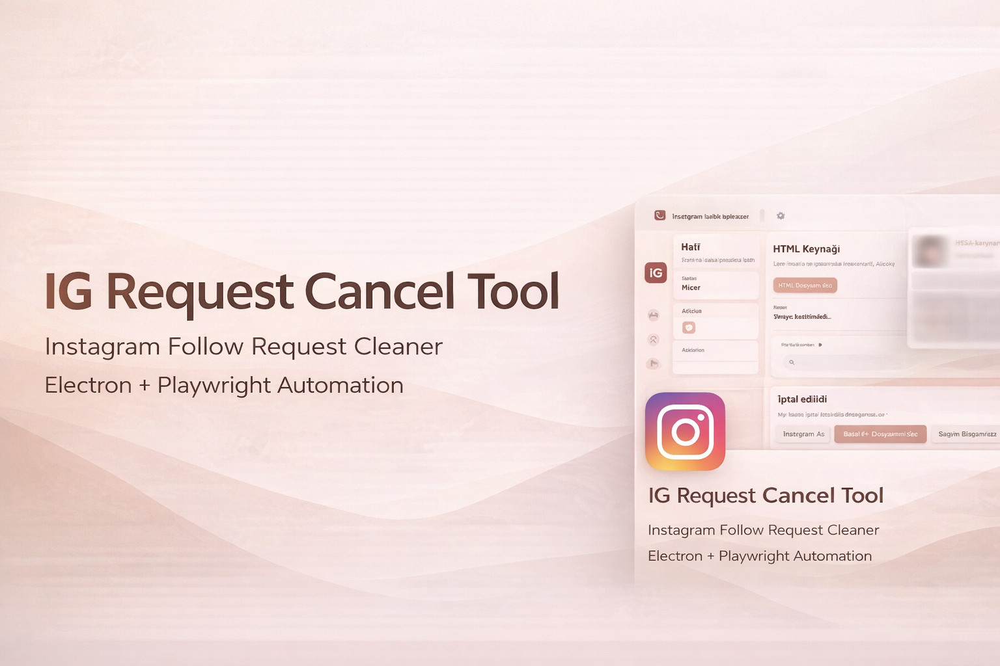

<p align="center">
  
</p>

# IG Request Cancel Tool

[](https://github.com/FrostyPD/IG-REQUEST-CANCEL-TOOL/releases)
[](LICENSE)
[]()
[](https://github.com/FrostyPD/IG-REQUEST-CANCEL-TOOL/stargazers)
[](https://github.com/FrostyPD/IG-REQUEST-CANCEL-TOOL/releases)

Instagram takip isteklerini otomatik ve güvenli bir şekilde silmenize yarayan masaüstü uygulaması.

✔️ Açık kaynak  
✔️ Şifre veya hesap bilgisi toplamaz  
✔️ Tüm kod GitHub üzerinde incelenebilir  

---
# 👾 VirusTotal
https://www.virustotal.com/gui/file/fc1bdcc63dd32a4f33a7a614b94571ee1cd8e2a46aad9477459cdfba9ac90171/detection


# ⬇️ İndir

Windows için hazır EXE dosyasını indirmek için:

[](https://github.com/FrostyPD/IG-REQUEST-CANCEL-TOOL/releases)

Alternatif olarak **Releases** sayfasından indirebilirsiniz:

https://github.com/FrostyPD/IG-REQUEST-CANCEL-TOOL/releases

---

# 🎬 Demo


---

# 📸 Uygulama Arayüzü


---

# 🚀 Özellikler

- HTML export dosyasından kullanıcıları parse eder
- Playwright ile profillere gidip isteği iptal eder
- Başlat / durdur sistemi
- Başarısızları yeniden deneme
- Seçili başarısızları yeniden deneme
- Canlı profil önizleme
- Log sistemi
- Rapor ekranı
- Ayarlar paneli
- Masaüstü bildirimleri

---

# 🧠 Nasıl Çalışır

1. Instagram hesap verilerini indir
2. Export klasöründen takip isteği HTML dosyasını bul
3. Uygulamada **HTML Dosyası Seç** butonuna bas
4. Instagram oturumunu aç
5. **Başlat / Devam Et** butonuna bas

Uygulama otomatik olarak bekleyen takip isteklerini iptal eder.

---

# ⚙️ Kullanım

1️⃣ Instagram veri exportunu indir  
2️⃣ Takip isteklerinin bulunduğu HTML dosyasını seç  
3️⃣ Instagram oturumunu aç  
4️⃣ Otomasyonu başlat  

Uygulama işlemleri güvenli şekilde sırayla yapar.

---

# 🔒 Güvenlik

Uygulama:

- Hesap bilgisi toplamaz
- Instagram API kullanmaz
- Sadece tarayıcı otomasyonu yapar
- Açık kaynak kodludur

VirusTotal tarama sonucu:

(VirusTotal linkini buraya ekleyebilirsin)

---

# 🛠 Kurulum (Geliştiriciler için)

Projeyi çalıştırmak için:

```bash
npm install
npx playwright install chromium
npm start
```

# 🧱 Build Alma

Uygulamanın Windows portable EXE dosyasını oluşturmak için:

npm run build

Oluşan dosya:

dist/

klasörü içinde olacaktır.

# 📦 Proje Yapısı
renderer/
src/
main.js
preload.js
package.json

# ⚠️ Not

Instagram otomasyon işlemleri için hız limitleri uygulanır.

Bu nedenle uygulama işlemleri:

belirli aralıklarla yapılır

güvenli gecikmeler kullanır

spam riskini azaltır

# ⚖️ Yasal Uyarı

Bu proje Instagram / Meta ile bağlantılı değildir.

Sadece kullanıcıların kendi hesaplarındaki bekleyen takip isteklerini yönetmelerine yardımcı olmak için geliştirilmiştir.

Kullanım tamamen kullanıcının sorumluluğundadır.

# 📜 Lisans

MIT License

# ⭐ Eğer projeyi faydalı bulduysan repo'ya yıldız bırakmayı unutma!
