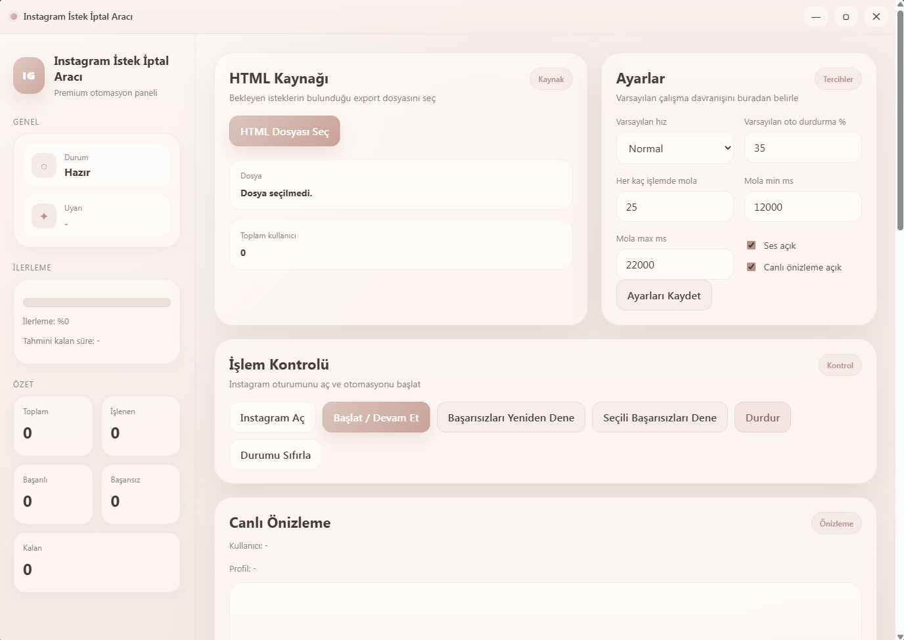

# IG Request Cancel Tool

Instagram takip isteklerini otomatik ve güvenli bir şekilde silmenize yarayan masaüstü uygulaması.

---

## ⬇️ İndir

Windows için hazır EXE dosyasını indirmek için:

---

## 🎬 Demo

---

## 📸 Uygulama Arayüzü

---

## Özellikler

- HTML export dosyasından kullanıcıları parse eder
- Playwright ile profillere gidip isteği iptal eder
- Başlat / durdur sistemi
- Başarısızları yeniden deneme
- Seçili başarısızları yeniden deneme
- Canlı profil önizleme
- Log sistemi
- Rapor ekranı
- Ayarlar paneli
- Masaüstü bildirimleri

---

## Kurulum (Geliştiriciler için)

Projeyi çalıştırmak için:

npm install
npx playwright install chromium
npm start

---

## Build Alma

Uygulamanın portable EXE dosyasını oluşturmak için:

npm run build

Oluşan dosya:

dist/

klasörünün içinde olacaktır.

---

## İndirme

Hazır `.exe` dosyasını indirmek için:

1. **Releases** sayfasına git  
2. En son sürümü aç  
3. `.exe` dosyasını indir  

Release sayfası:

https://github.com/FrostyPD/IG-REQUEST-CANCEL-TOOL/releases

---

## Yasal Uyarı

Bu proje **Instagram / Meta ile bağlantılı değildir.**

Sadece kullanıcıların kendi hesaplarındaki **bekleyen takip isteklerini yönetmelerine yardımcı olmak için geliştirilmiştir.**

Kullanım tamamen kullanıcının sorumluluğundadır.

---

## Lisans

MIT License
